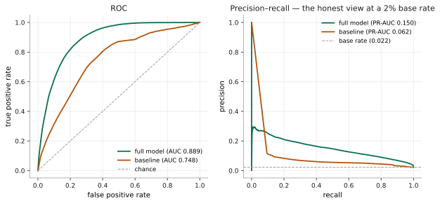
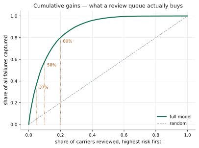
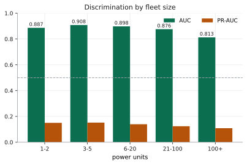
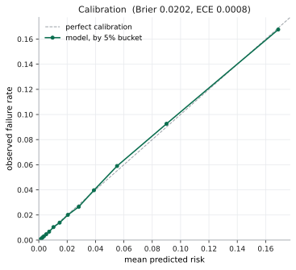

# Carrier Survival

Predicting whether a motor carrier will still be operating twelve months from
now, from public FMCSA data.

Freight brokers, insurers, factoring companies and equipment lessors all carry
exposure to carriers that may not exist next year, and the tools available to
them are backward-looking: you can check whether a carrier's authority is active
*today*, but nothing tells you the odds it survives the length of a contract.

**Status: working end-to-end.** Ingestion, labels, point-in-time features,
models and leakage controls all run. Results below.

New to survival modelling or to the terms used here — *vintage*, *leakage*,
*point-in-time*, *lift*? [**docs/GLOSSARY.md**](docs/GLOSSARY.md) defines them in
the context of this project rather than in the abstract.

---

## Results

1.94M carriers, 11.8M carrier-months, seven monthly prediction dates in 2024,
2.25% twelve-month failure rate. Split by **carrier**, not by row — a carrier
appears at up to seven dates with overlapping outcome windows, so a random row
split would put the same carrier on both sides and inflate every score.

| Model | AUC | PR-AUC | Base rate | Lift |
|---|---|---|---|---|
| Baseline — carrier age + fleet size | 0.748 | 0.062 | 0.022 | 2.8x |
| **Full feature set** (26 features) | **0.889** | **0.150** | 0.022 | **6.7x** |

The baseline is deliberately trivial: two columns anyone can compute in a single
query. It exists because "the model gets 0.89 AUC" means nothing on its own. The
full feature set beats it by **+0.142 AUC**, which is the number actually worth
reporting.

The 2.25% base rate is itself a result. An earlier version of this pipeline read
one file of a three-part monthly export and reported 6.08% — nearly 3x too high,
because the part it read was skewed toward carriers that fail. The corrected
figure cross-checks against the revocation record independently (31k–85k
failures a year against ~2M carriers, or 1.5–4%), which the old one never did.
Every metric here is measured against that base, so the error propagated into
all of them.



The precision–recall panel is the honest one. At a 2.2% base rate, ROC flatters
any model by rewarding correct rankings among the vast majority of survivors;
PR shows what actually happens when you go looking for the rare event.

### What it buys you

The question a broker or underwriter actually asks is not "what is the AUC" but
"if I only have time to review part of my book, how much of the risk do I catch?"

| Review the riskiest… | Failures captured |
|---|---|
| 5% of carriers | **37%** |
| 10% of carriers | **58%** |
| 20% of carriers | **80%** |



Reviewing one carrier in ten surfaces well over half of everything that fails in
the following year.

### By fleet size

Segmented at evaluation rather than filtered at training — micro-carriers are
most of the population and dropping them would change the base rate rather than
improve the model.

| Fleet | Carriers | Base rate | AUC | PR-AUC |
|---|---|---|---|---|
| 1–2 | 2,259,837 | 2.2% | 0.887 | 0.150 |
| 3–5 | 376,679 | 1.8% | 0.908 | 0.152 |
| 6–20 | 201,013 | 1.8% | 0.898 | 0.139 |
| 21–100 | 50,759 | 1.7% | 0.876 | 0.124 |
| 100+ | 10,777 | 1.1% | 0.813 | 0.109 |



Discrimination is strong and fairly flat from 1 to 100 units, easing off only for
the largest fleets — where failure is rarest and most idiosyncratic.

Micro-carriers used to be the visible weak spot (0.741 against 0.848 for large
fleets). That gap was mostly an artefact of the ingestion defect: the part of the
export being read under-sampled them, so the model saw too few to learn from.
With the full population they perform in line with everything else.

### Calibration

Ranking and calibration are independent. A model can order carriers perfectly
and still be badly wrong about the *level* of risk — and level is what you need
the moment a number touches pricing rather than prioritisation.

| Measure | Value |
|---|---|
| Brier score | **0.0202** |
| Expected calibration error | **0.00078** |



An ECE of 0.0008 against a 2.24% base rate means predicted risk tracks observed
failure to within roughly **0.08 percentage points** on average. Buckets are
equal-count rather than equal-width: at a 2% base rate predictions pile up at the
low end, so equal-width buckets leave the top ones nearly empty and the curve
degenerates into noise.

The model is usable for pricing as well as triage, which was an open question
until this was measured — and worth stating plainly, because a good AUC is
routinely mistaken for evidence of calibration when it is no evidence at all.

### Leakage controls

A model that has seen the future scores beautifully and is worthless, with no
error to warn you. Two checks run on every training run:

**Solo AUC.** Any single feature separating the outcome implausibly well
(≥ 0.90) is almost certainly derived from it. The strongest honest feature here
reaches 0.743:

```
days_since_mcs150              0.743
carrier_age_days               0.732
distinct_dockets               0.695
authority_actions              0.694
prior_discontinued             0.690
```

**Temporal decay.** Train at the earliest prediction date, then score the *same
held-out carriers* twice — once at that date, once six months later. Only the
age of the information differs, so performance should fall.

```
scored at the same date : AUC 0.887
scored 6 months later   : AUC 0.888
temporal decay: -0.001 - within noise, inconclusive (needs decay > 0.01)
```

Reported as **inconclusive**, not as a pass. One thousandth is noise, and
calling it a pass would manufacture confidence the data doesn't support.

The controls are themselves tested against a **planted leak** — a feature built
from the outcome with 10% of labels flipped — and the suite asserts the detector
catches it (`tests/test_leakage.py`). A check that has never been shown to fail
is not evidence; it may simply be incapable of firing. Training aborts rather
than reporting results if anything trips.

Three failure modes now abort the run: a feature above the solo-AUC threshold, a
probe that scores below 0.5 (it is ranking failures as safer than survivors, so
its decay number is meaningless), and a decay that is meaningfully *negative* —
performance improving as information ages, which no honest model does.

---

## What this is not

This is not a safety score. It does not estimate crash risk, and it is not a
competitor to CSA percentiles or any commercial risk product. It answers one
different question: *will this business still be here?*

Nothing in this repository derives from any proprietary scoring model. See
[Boundaries](#boundaries).

---

## The label

The obvious label — "did FMCSA revoke this carrier's authority?" — is wrong, and
the data says so plainly. `AuthHist` records how each revocation proceeding
resolved:

| Disposition | Count |
|---|---|
| **DISCONTINUED REVOCATION** | **2,208,586** |
| REVOKED | 1,600,771 |
| FAILURE TO REAPPLY | 9,743 |
| ADMINISTRATIVE INACTIVATION | 3,572 |

More proceedings are discontinued than executed. Most revocations begin with an
insurance lapse; the carrier files a new policy and continues trading. A further
**498,866** `REINSTATED` actions confirm it. Training on "a revocation happened"
means training mostly on carriers having a bad month.

So exit is defined as:

> `disp_action_desc = REVOKED` **and** no `REINSTATED` or `GRANTED` action for
> that carrier within the following 12 months.

**Exit type is separated**, because the `Revocation` file distinguishes
involuntary (1,329,063) from voluntary (200,017) surrender. A carrier that
voluntarily wound down did not fail — it left the risk pool, which makes it a
competing risk rather than a negative case to learn from.

### Result

```
revocation events           1,373,059
  undatable                   114,164   ( 8.3%)  carriers excluded
  returned within 12 months   308,699   (24.5% of datable)  censored
  permanent exits             950,196   (75.5% of datable)

POSITIVE CLASS (involuntary, permanent)   949,982
distinct carriers                         772,553
```

Between 31k and 85k failures per year across 2015–2025 — ample for the modelling
window.

### The two exit types are dated in different columns

Undocumented, and quietly destructive if missed:

| Type | `order2_effective_date` | `order1_serve_date` |
|---|---|---|
| Involuntary | **96.6%** | 99.7% |
| Voluntary | **0.05%** (92 of 200,017) | 29.3% |

Keying the exit date off `order2_effective_date` alone discards 99.95% of
voluntary exits — and leaves those carriers in the data looking like survivors,
which is a mislabel rather than a gap. The exit date therefore coalesces both
columns, and anything still undatable is flagged `exclude_from_training` so the
carrier is dropped instead of counted as surviving.

### Voluntary exit cannot be modelled as a competing risk here

Even after coalescing, only 212 voluntary revocations resolve to a permanent
exit. Almost all datable voluntary surrenders are followed by a new grant of
authority within a year — restructuring, re-registration or transfer rather than
departure. The competing-risks arm is therefore effectively empty, and the model
is scoped to involuntary exit alone. This is a limitation of the source, not a
modelling choice.

### Prediction window

Features are frozen at month 0 and the outcome is measured over **months 6–18**.
The blackout matters: insurance lapse mechanically triggers revocation about a
month later, so a model predicting the near term would mostly rediscover FMCSA's
own published procedure. Pushing the horizon out forces it to find signal that
precedes the administrative cascade.

### What this cannot see

Authority status is a legal proxy for operating status. A carrier that keeps its
authority and insurance current while hauling nothing is invisible here. No
public source resolves that.

---

## Features

26 features survive the degenerate-column filter, all constructed strictly from
information available at the prediction date:

| Group | Features |
|---|---|
| **Crash history** | Counts, fatalities, injuries and tow-aways over 6/12/24 months and lifetime; days since last crash |
| **Authority lifecycle** | Age of authority, prior revocations, prior reinstatements, prior discontinued proceedings, total actions, distinct dockets, days since last action |
| **Registration** | Carrier age, undeliverable address flag, prior revoked DOT number flag |
| **Fleet** | Power units, driver count |
| **Filing behaviour** | Days since last MCS-150 filing, age of the reported mileage year |

Three columns are dropped automatically as degenerate: `mileage` (100% null in
every *archived* vintage — the public API carries it at 95.9%, so fresh pulls fix
this going forward) and both fleet-trajectory features — see below.

### The fleet-trajectory features cannot be built from this archive

This is the significant negative result of the project, and it undercuts the
original rationale for choosing a panel-limited design.

`power_units_chg_3m` and `power_units_chg_12m` were meant to capture fleet
momentum — a carrier shedding trucks before it fails. Both compute to **exactly
zero for every carrier**, because the monthly reporting exports do not refresh
that column. Per-carrier comparison across the archive:

```
202404 -> 202405   702,589 carriers in both   0 changed
202405 -> 202406   689,092                    0 changed
202406 -> 202407   678,132                    0 changed
202407 -> 202408   674,047                    0 changed
202408 -> 202409   667,154                    0 changed
202409 -> 202410   656,517                    0 changed
202410 -> 202412   631,131               78,501 changed  (12.4%)
202412 -> 202505   627,792                    0 changed
```

`power_units` moves at exactly one boundary in the reporting vintage and is
frozen everywhere else, including five straight months from December 2024 to May
2025. **15 of 23 archived periods are republished copies of earlier data.** The
timestamp advances; the fleet numbers do not.

The features are now correctly null rather than falsely zero, and the training
script drops them.

#### It is the whole file, not just that column

`state` is what settles it. Carriers relocate constantly, so that field cannot
be *exactly* unchanged over a real month — and it isn't, at the one boundary
that moves:

| Transition | power_units | driver_count | safety_rating | status | state |
|---|---|---|---|---|---|
| 202407 → 202408 | 0.00% | 0.00% | 0.00% | 0.00% | 0.00% |
| 202409 → 202410 | 0.00% | 0.00% | 0.00% | 0.00% | 0.00% |
| **202410 → 202411** | **12.26%** | **12.39%** | **0.61%** | 0.00% | **0.63%** |
| 202411 → 202412 | 0.00% | 0.00% | 0.00% | 0.00% | 0.00% |

Every column freezes together and thaws together. That is a republished extract,
not a field that updates on its own cadence.

#### Even a perfect pipeline would only get so far

Fleet size changes only when a carrier files an MCS-150. That filing is required
every 24 months on a schedule keyed to the USDOT number — the last digit sets
the month, the second-to-last sets odd or even year — plus event-triggered
filings on a change of address, operation type, or authority application.

Roughly **1/24 ≈ 4.2% of carriers can update in any given month**, and the one
genuine refresh in the reporting archive shows 12.26% over about three months —
4.1% per month, landing on the biennial rate almost exactly.

But the filing rate is a *ceiling*, not the answer, and the gap between them
turned out to matter. Measured directly across two consecutive fresh pulls 28
days apart:

| Field | Carriers changed |
|---|---|
| `mcs150_date` | **240,179 (6.13%)** |
| `power_units` | 10,446 (0.23%) |

Carriers file on schedule, but **most filings do not change the truck count** —
they are address updates and re-certifications. So fleet size moves roughly 0.2%
a month even against a perfectly fresh source, and a three-month delta would be
non-zero for well under 1% of carriers. An earlier estimate here put that at
~12%, reasoning from the filing cycle alone; the direct measurement is more than
an order of magnitude lower.

Fleet trajectory is therefore not merely limited by this archive. It is a weak
feature by nature, and no pipeline improvement rescues it. Filing *recency*,
which moves 6% a month, is where the signal actually is — which is what the
model independently found.

#### The better feature is filing behaviour, not fleet size

The same MCS-150 rule that limits fleet trajectory turns out to supply the
strongest feature in the model.

`mcs150_date` — *when* the carrier last filed — is 0% populated in `reporting`,
the vintage the cohort is drawn from, but 89% populated in the late-2023 census
exports that precede every prediction date. `static_features` reads slow-moving
attributes from any earlier vintage, so it can be carried across.

**`days_since_mcs150` is now the highest solo-AUC feature at 0.743**, ahead of
carrier age at 0.732. Adding it and `mileage_report_age_years` moved the model
from 0.874 to **0.889** and lift from 6.5x to **6.7x**.

The reason it beats fleet size is that it measures behaviour rather than
capacity. Filing is mandatory every 24 months on a published schedule. A carrier
drifting well past its deadline has stopped doing paperwork, and carriers that
stop doing paperwork are usually winding down — whereas a stale power-unit count
mostly reflects when the schedule last came round.

**The lag is real and worth stating.** The only vintages carrying `mcs150_date`
before the 2024 prediction dates are the late-2023 exports, so the reading is up
to eight months old at the last prediction date, and a carrier that filed in
between looks more overdue than it is. That is noise, not leakage — it is
genuinely what someone holding those snapshots would have known, and the maximum
`mcs150_date` in the panel is 2023-12-09, comfortably before every prediction
date. But the feature is weaker here than a live feed would make it, and weaker
at later prediction dates than earlier ones. A monthly pull that carries the
field would improve it for free.

---

## Sources

All from the [DOT Public Data Portal](https://data.transportation.gov/). The
older `catalog.data.gov` listings mirror the same data but are no longer the
maintained surface.

| Dataset | ID | Rows | Coverage | Role |
|---|---|---|---|---|
| Crash File | `aayw-vxb3` | 4.97M | **1982–2026** | Features — full history, no null dates |
| AuthHist – All With History | `9mw4-x3tu` | 4.94M | 1996–2026 | Label + authority lifecycle |
| Revocation – All With History | `sa6p-acbp` | 1.53M | 1996–2026 | Label, exit type |
| Vehicle Inspection File | `fx4q-ay7w` | 8.30M | **2023–2026 only** | Features — recent model only |
| Company Census | `az4n-8mr2` | 4.48M | current snapshot | Reference only |

### Sources evaluated and rejected

**`Motus InsHist`** (`3uet-3z4i`) is described as previous insurance policies but
is not a history. Of 53,490 rows, 34,858 have no cancellation date, and of the
18,632 that do, **18,572 fall in 2026** — earlier years are single digits. It
cannot support historical insurance features.

**Company Census** is overwritten daily with no published archive, so fleet size
and safety rating cannot be reconstructed for any past date from the API. A FOIA
request for internal historical snapshots was filed; FMCSA quoted 9–12 months.
Local monthly captures are used instead (below).

---

## Archived monthly census snapshots

FMCSA's census gap is filled by monthly pulls of the same public Company Census
file, archived locally before the collection was automated. They cover 23
periods between Nov 2023 and Jul 2026.

They are ordinary FMCSA public data — the only thing special about them is that
someone kept copies. Point `CARRIER_SURVIVAL_SNAPSHOT_DIR` at your own archive;
no path is hardcoded.

### The 2024 exports come in three parts

Each 2024 month directory holds three files that partition the active
population. They must all be read:

| Part | Rows (202407) | Mean fleet | p90 |
|---|---|---|---|
| Scored | 721,168 | 19.9 | 9 |
| Not Scored 1 | 350,813 | 3.2 | 5 |
| Not Scored 2 | 789,387 | 97.7 | 3 |
| **Combined** | **1,861,368** | | |

1,861,184 of those 1,861,368 rows are distinct carriers, and 99.8% carry
`status = A`. That matches FMCSA's ~2M active carriers. Only the 2024
directories are split this way; the 2025 exports are the scored slice alone, so
those months remain a partial view no matter how they are read.

### Why absence from a snapshot is not the exit signal

The intuitive label — *a carrier in one month and gone the next went out of
business* — does not survive contact with the data:

```
transition          prior        now      gone   gone%       new       net
202406->202407  1,854,671  1,861,184     1,833   0.10%     8,346    +6,513
202407->202408  1,861,184  1,867,779     1,246   0.07%     7,841    +6,595
202408->202409  1,867,779  1,876,462     1,938   0.10%    10,621    +8,683
202409->202410  1,876,462  1,882,556     2,289   0.12%     8,383    +6,094
```

Disappearance runs 0.07–0.12% per month — about 1% a year, against the 1.5–4%
annual failure rate the revocation record shows. New registrations outnumber
disappearances 3–6 to 1, so the population *grows* through a period when the
freight market was shedding carriers.

Tested directly as a predictor: of carriers that vanished in August 2024 and had
not returned by October, **4.61% were later revoked, against 3.29% of those that
stayed — 1.40x lift, over 1,193 carriers.** Too rare to be a label and too weak
to be a feature.

The reason is that FMCSA leaves carriers in the census long after they stop
hauling, so membership tracks administrative purges rather than business death.
This is why the label is built from dated revocation events instead: those are
timestamped decisions, not inferences drawn from a missing row.

### Automatic quality checks

`coverage_report()` detects three defects automatically rather than leaving them
to be found later:

**Population break.** Three export types are interleaved — 0.7M, 2.2M and 4.5M
carriers. **1,464,357 carriers appear to vanish** at the Feb→Apr 2024 boundary.
They did not exit; they were never in scope for the second file. Features are
never differenced across a vintage boundary, because such a delta measures which
file a carrier appeared in.

**Truncated export.** `202501` holds 507,916 carriers against a ~700K median. It
drops 206,085 from December, and **198,603 of them (96%) reappear in February.**
Real exits do not come back.

**Stale republish.** Detailed above — 15 of 23 periods repeat the previous
period's values.

All three exclude the affected periods from differencing. The label is unaffected
either way, because exit is derived from dated event streams rather than from a
carrier's absence from a file.

---

## Thirteen silent defects

None of these raised an error. Each produced plausible-looking output that was
wrong, and each now has an automated guardrail and, where testable, a regression
test. This catalogue is the part of the project most worth reading.

| # | Defect | How it presented | Guardrail |
|---|---|---|---|
| 1 | Socrata `$offset` paging without `$order` walks an unordered set | Row counts correct, contents quietly duplicated and missing | Explicit `$order=:id` on every page request |
| 2 | `Sum of Nbr Power Unit` sat at column 0 — a grand total, not a fleet size | `5,726,224` on all 713,276 rows | Preference-ordered column resolution + `_reject_constant_columns()` |
| 3 | Exit types dated in different columns | 99.95% of voluntary exits silently relabelled as survivors | Coalesce both date columns; flag the remainder `exclude_from_training` |
| 4 | pandas 3.0 gives text columns dtype `str`, not `object` | `Y`/`N` flags fell through to `to_numeric` → NaN → `fillna(0)` → all zeros | Test `is_numeric_dtype`, not `dtype == object` |
| 5 | Type collisions across vintages (`add_date` int vs text, `county` numeric vs text) | Passed every per-file check, failed only at panel write | `TEXT_COLUMNS` normalisation + explicit date parsing |
| 6 | Population break between export vintages | 1.46M carriers "vanish"; a naive delta reads as mass fleet collapse | `population_break` flag; vintage-scoped differencing |
| 7 | Truncated `202501` export | 206K carriers "exit", 96% of them return in February | `suspect_truncation` flag |
| 8 | Stale republished exports masked by `NaN != NaN` | Detector saw a 5.6% null rate as 5.6% "changed", clearing its 0.1% threshold — six frozen months reported as fresh | Compare only rows non-null on both sides; regression test with nulls on both sides |
| 9 | An all-null column reaches sklearn's binner | `ValueError: window shape cannot be larger than input array shape` — says nothing about the cause | Degenerate-column filter before fitting |
| 10 | A monthly export split across three parts, of which one was read | 717K of 1.86M carriers — a **non-random 39%**, since the parts have mean fleet 19.9, 3.2 and 97.7 | Read every file matching the winning pattern, not the first; de-duplicate on carrier-period |
| 11 | The decay probe trained on carriers that *dropped out* and scored ones that *persisted* | Two different populations, so the probe inverted — AUC 0.302, ranking failures as safer | Hold out a random slice of carriers present at both dates; abort if probe AUC < 0.5 |
| 12 | The decay verdict compared `abs(decay)` against its threshold | A probe improving with staleness (0.302 → 0.323) printed "degrades as expected" | Only a *fall* passes; a meaningful rise is a failure |
| 13 | A third date format (`M/D/YYYY`) in one vintage, parsed with a hard-coded `format="%Y%m%d"` and `errors="coerce"` | Every date in the Nov 2023 export became `NaT`, reading downstream as "the source never carried this field" | Try the dominant format, fall back to a general parse, and **raise** if under 10% of populated values parse |

**Defect 10 was invisible from inside the data.** Every check passed: row counts
were stable, carrier counts moved plausibly month to month, no column was
constant, no vintage was mixed. The file simply looked like a complete monthly
census because it was internally consistent — and nothing in it could reveal
that two sibling files existed alongside it. It was caught by someone who knew
how the archive was assembled saying so. No amount of profiling would have
found it, which is worth remembering before trusting a clean-looking data audit.

**Defect 13 produced a false conclusion, not just a gap.** The November 2023
export's dates all coerced to `NaT`, and the coverage report duly showed that
vintage as 0% populated for `mcs150_date` — which was read, reasonably and
wrongly, as evidence that FMCSA had not yet added the field. The column was
there all along, at 89%, in a different format under a different name. A silent
parse failure and an absent field are indistinguishable downstream, which is why
the parser now raises instead of coercing.

**Defects 11 and 12 were in the leakage control itself**, which is the part of
this repository whose entire purpose is to catch exactly this class of error.
Both were live while the check printed `0.692 / 0.688 — OK`, and that reassuring
output was reported as evidence. It was not evidence of anything; the probe was
already broken, and the population defect simply made the breakage visible by
pushing the AUC below 0.5 where it could no longer be mistaken for a result.

The lesson is the one the planted-leak test was built for and did not cover: a
guardrail is only as trustworthy as the failures it has been *shown* to catch.
The planted leak proved the solo-AUC arm could fire. Nothing had ever proved the
decay arm could, so it quietly returned a pass for months.

Two more worth noting, though they are judgment rather than defects: revocation
is not exit (see [The label](#the-label)), and AuthHist carries corrupt dates —
observed years include 0189, 2044 and 2517 — which are dropped rather than
clamped, since a wrong date is worse than a missing one when the entire design
depends on knowing what was true when.

**Defect 8 is the instructive one.** The staleness detector was written
specifically to catch republished exports, was per-carrier and correct in
outline, and still failed — because `NaN != NaN` is `True` in pandas, so
carriers null in *both* exports counted as changed. That alone cleared the
threshold. The guardrail existed, ran on every build, and reported the opposite
of the truth for months.

---

## Keeping it current

FMCSA overwrites the company census in place and publishes no archive, so
today's snapshot is unrecoverable tomorrow. Point-in-time features need what was
true *then*. Keeping a dated copy of every pull is the whole mechanism by which
a daily-overwritten source becomes usable history — there is no cleverer trick,
and the value compounds only if the pull actually runs.

```bash
python scripts/refresh_census.py     # writes census_YYYYMMDD.parquet
python scripts/build_panel.py && python scripts/build_features.py
```

### Where the archive lives

`CARRIER_SURVIVAL_SNAPSHOT_DIR` accepts **several directories**, separated by the
platform path separator, because the archive legitimately spans more than one
place:

```bash
# read from both; write fresh pulls only to the second
export CARRIER_SURVIVAL_SNAPSHOT_DIR=/archive/historical:/data/carrier-census
export CARRIER_SURVIVAL_REFRESH_DIR=/data/carrier-census
```

Historical exports usually sit wherever they were originally collected — often
shared or managed storage, and often tens of gigabytes that nobody wants to
move. Snapshots written by `refresh_census.py` are public data belonging to this
project alone, so they have no reason to be added to someone else's drive.
Keeping the two apart is a data-ownership decision, not a tidiness one.

Roots merge **whole periods**, earliest root winning a contested one. Merging
file by file would let a single-file pull attach itself to a three-part export
and leave the period part stale, part fresh.

The public census (`az4n-8mr2`, 4.49M rows) carries `mcs150_date`,
`mcs150_mileage`, `power_units`, `total_drivers` and `status_code` — everything
the model uses. Its column names already match the canonical keys the loader
resolves, so archived CSV vintages and fresh API pulls land in the same panel
with no translation layer.

**Monthly is the right cadence**, confirmed by measurement rather than assumed.
Across two consecutive pulls 28 days apart, `mcs150_date` changed for 6.13% of
carriers and `power_units` for 0.23%. A weekly pull would spend four times the
requests to watch a field that moves a few percent a month.

A fresh snapshot is immediately usable: the August 2026 pull came in at 4,490,454
carriers, 1.007x the median for its vintage, and cleared truncation, population
break and staleness on the first try — `safe_to_diff` with no special-casing.

Two guards, because a bad pull is worse than no pull: the request is refused if
it returns under 3M rows (a partial response would read downstream as a
population collapse), and an existing snapshot for the day is never overwritten.

Only 15 of the 53 available columns are requested. The rest are contact details
— phone, email, officer names, D&B number — that this project has no reason to
hold. Narrowing the projection is a privacy decision before it is a performance
one.

**This deliberately does not read from any private warehouse.** The project's
claim is that it reproduces from public sources; a dependency on a private
workspace would quietly make that false, and would couple the model to a refresh
schedule it does not control.

---

## Boundaries

The local snapshot files also contain proprietary risk scores from a separate
commercial product. **They are excluded at read time**, not filtered later:
`census_history.py` never reads a column matching `/score/i`, and
`assert_no_proprietary_columns()` raises if one reaches a frame.

Only public FMCSA census fields are used — power units, driver count, safety
rating, status, state, MCS-150 date and mileage year. This keeps the model
reproducible from public sources by anyone, and keeps the commercial product's
intellectual property out of it.

---

## Layout

```
src/carrier_survival/
  config.py          Dataset definitions and column projections
  fmcsa.py           Paged SODA extraction, key and date normalisation
  census_history.py  Snapshot loader, coverage and quality checks
  labels.py          Exit label construction with the 12-month return window
  features.py        Point-in-time feature construction and the risk set
  leakage.py         Solo-AUC and temporal-decay leakage detection
scripts/
  fetch_fmcsa.py     Download FMCSA sources to data/raw/
  refresh_census.py  Archive a dated copy of the public census (run monthly)
  build_panel.py     Build the carrier-period panel from local snapshots
  build_labels.py    Build the exit label table
  build_features.py  Build the modelling frame
  train_baseline.py  Fit baseline + full model, evaluate, check for leakage
  make_charts.py     Write docs/charts/*.svg and docs/metrics.json
docs/GLOSSARY.md     Terminology used throughout, defined in context
docs/metrics.json    Committed results, inspectable without running anything
docs/charts/         Committed evaluation charts
tests/               33 tests: discovery, feature construction, coverage, leakage
data/                Parquet + manifests (gitignored; re-fetchable)
```

## Running it

```bash
pip install -r requirements.txt

python scripts/fetch_fmcsa.py --list     # available datasets
python scripts/fetch_fmcsa.py            # fetch all defaults (~20 min)
python scripts/build_labels.py           # build the exit label table

# The panel needs the local census archive; everything else runs from the API.
export CARRIER_SURVIVAL_SNAPSHOT_DIR=/path/to/snapshots   # or several, see below
python scripts/refresh_census.py         # optional: archive today's public census
python scripts/build_panel.py            # carrier-period panel + coverage report
python scripts/build_features.py         # point-in-time modelling frame
python scripts/train_baseline.py         # models, segments, leakage checks
python scripts/make_charts.py            # charts + docs/metrics.json

pytest                                   # 33 tests
```

Each fetch writes a manifest recording row counts, distinct carriers, null keys
and fetch time beside its Parquet file.

### Two implementation details that are load-bearing

**Paging is ordered by `:id`.** Socrata's `$offset` walks an unordered result
set, so without an explicit `$order` a row can arrive twice while another never
arrives. Nothing errors — the row count comes out right and the contents are
quietly wrong.

**Keys and dates are normalised on ingest.** The USDOT number is `dot_number` in
some files and `usdot_number` in others, zero-padded in one and bare in the next.
Dates arrive in three shapes across the archive — `YYYYMMDD` as text, the same as
an integer in the Parquet vintage, and `M/D/YYYY` in the Nov 2023 export — so a
single hard-coded format silently nulls a whole vintage (defect 13).

---

## Limitations

- **No fleet trajectory.** The archive cannot support it; see above. This is the
  largest gap, because fleet momentum is the most intuitively predictive signal
  available.
- **Seven prediction dates in one year.** Point-in-time features need the
  archived panel, which limits the modelling window to 2024. The model has not
  been tested across a freight cycle.
- **The temporal-decay check is inconclusive** at `-0.001`. It is no longer
  *broken* — see defects 11 and 12 — but six months is not enough separation for
  it to say anything, which again needs more panel.
- **Involuntary exit only.** The competing-risks arm is empty for the reasons
  above.
- **Authority status is a proxy for operating status.** A dormant carrier holding
  active authority is indistinguishable from a working one.
- **2025 months are a partial population.** Only the 2024 directories hold the
  three-part export. The 2025 files are the scored slice alone (~700K against a
  ~1.86M full population), so those periods trip `suspect_truncation` and are
  excluded from differencing. The exclusion is correct; the label is imprecise —
  it is a scope difference, not a truncated file.
- **`days_since_mcs150` is read with a lag of up to eight months**, because the
  only *archived* vintages carrying it precede the prediction window. It is the
  strongest feature in the model despite that. `scripts/refresh_census.py` closes
  this going forward — see [Keeping it current](#keeping-it-current) — but it
  cannot retroactively fill 2024.
- **`business_org` is all-null in the modelling window.** It appears only in the
  `datahub` vintages, which post-date every 2024 prediction date, so the
  point-in-time lookup correctly finds nothing.
